# 🎵 LyricLensAI  
*LyricLensAi is a creative writing assistant that analyzes lyrics, identifies genre influences, provides feedback, and offers suggestions to adapt lyrics to different genres.*

It combines **NLP + Machine Learning + LangChain agents** to provide an **interactive chat experience** for exploring lyrical styles and recommendations.  


<!-- Core ML / DS -->


<!-- NLP & LLMs -->


<!-- Deployment / Frontend -->


<!-- General -->

 
[](LICENSE) 
[]()  

---

##  Features

- **Genre Detection**: A logistic regression model analyzes input lyrics and predicts genre influences.
- **Explainability**: Summaries and trigger words explain why certain genres were detected.
- **Creative Feedback**: Gets lyrical suggestions and reviews via Llama 3.2 Instruct (via Hugging Face).
- **Multi-Mode Agent**: Supports modes like Q&A, chit-chat, lyrical review, and genre suggestion.
- **English-only Filter**: Detects if lyrics are not in English and prompts the user accordingly.

---

##  Tech Stack

- Python 3.10+  
- **ML Components**:
  - Logistic Regression (sklearn)
  - Text cleaning (NLTK, spaCy)
  - Language detection (`langdetect`)
- **LLM Integration**:
  - Local: Ollama + Llama3.2  
  - Remote: Hugging Face inference (`meta-llama/Llama-3.2-3B-Instruct`) using `langchain-huggingface`
- **UI**: Streamlit for front-end chat interface
- **Prompt Chain**: LangChain for orchestrating prompts, templates, and memory

---

##  Repository Structure
    

---

##  Installation & Setup

1. Clone the repo:
   ```bash
   git clone https://github.com/Shiv33ndu/LyricLensAi.git
   cd LyricLensAi

2. Create a virtual environment and install dependencies:
   ```bash
   python -m venv venv
   source venv/bin/activate  # or `venv\Scripts\activate` on Windows
   pip install -r requirements.txt

4. (Optional) To use Hugging Face LLaMA model:
   - Sign up at Hugging Face and generate an API Token.
   - Store it as an environment variabe:
     ```bash
     export HUGGINGFACEHUB_API_TOKEN='your_token_here'

---

## Running Locally
    ```bash
    streamlit run streamlit_app.py
  

Interact with the UI:
- Paste your lyrics (English Only)
- Ask questions ("What's the genre? Review my lyrics.")
- Request suggestions ("Make this sound more like Country or Hip-Hop")

---

## How The App Works

1. **Classification**: User input is routed via agent prompt to classify as `lyrics`, `suggestion`, `chat`, or `question`.
2. **Language Filter**: Lyrics input is language-checked; non-English lyrics trigger a friendly error.
3. **Genre Model**: For lyrics input, text cleaning is applied, then logistic regression predicts genres and summaries.
4. **LLM Feedback**: Depending on mode, either a creative review or suggestion is generated using the LLaMA model.
5. **UI Streaming**: All outputs stream within Streamlit’s chat UI, keeping the pipeline interactive.

---


## 🚀 How the ML Model Works

### 1. Input Processing
- User submits **lyrics** (raw text).
- Lyrics are passed through two cleaners with different goals:

| Cleaner   | Role                                                                                       |
|-----------|--------------------------------------------------------------------------------------------|
| **spaCy** | Strict, linguistically-informed tokenization. Extracts **only words (no punctuation/verbs)** to build a **genre vocabulary** for trigger-word mapping. |
| **NLTK**  | Performs slang tokenization using `TweetTokenizer`, lighter normalization (lowercasing, stemming/lemmatization, removing stopwords). Prepares text for **classification**. |

---

### 2. Genre Prediction
- Cleaned lyrics → transformed into **numerical features** using:
  - **TF-IDF Vectorizer** (`vectorizer_145_prob.pkl`)
  - **Label Encoder** (`encoder_145_prob.pkl`)
- Features are passed into **Logistic Regression model** (`genre_predict_145_prob.pkl`) which outputs:
  - **Probabilities** across 18 supported genres.
  - **Top Genre** (highest probability).

---

### 3. Explainability
- spaCy vocabulary tokens are cross-checked against a **genre-specific dictionary**.  
- These tokens highlight **trigger words** responsible for predictions.  
- Example: “dancing”, “stars” → strongly tied to **Pop**.

---

### 4. LLM-Powered Feedback
- Classifier output (genres + trigger words + summary) is fed into a **LangChain agent**.
- LLM generates:
  - **TL;DR Genre Review** (short summary of prediction).
  - **Detailed Lyric Review** (constructive suggestions based on genre style).

---

### 📊 Flow of the ML Pipeline

```mermaid
---
config:
  theme: neo-dark
  look: neo
  layout: dagre
---
flowchart TD
    A["🎤 User Lyrics Input"] --> B["🧹 Preprocessing"]
    B --> B1["spaCy Cleaner - Strict tokenization, vocab building"] & B2["NLTK Cleaner - Lowercasing, stopword removal, lemmatization"]
    B1 --> C1["Trigger Word Vocabulary"]
    B2 --> C2["TF-IDF Vectorizer + Encoder"]
    C2 --> D["🎶 Logistic Regression Classifier"]
    D --> E["📈 Genre Probabilities"] & F["🏆 Top Genre Prediction"]
    C1 --> G["🔑 Trigger Word Mapping"]
    E --> H["LangChain + LLM Review"]
    F --> H
    G --> H
    H --> I["✨ Final Output - TL;DR Summary + Review + Suggestions"]
    n1["CORE CLASSIFIER ML MODEL"] --> D
    D@{ shape: rect}
    n1@{ shape: card}
    style D fill:#000000,color:#FFFFFF,stroke:#FFD600
    style n1 stroke:#2962FF,fill:#000000

```



## Example Workflow

1. **User Input:**
     ```bash
     “Dancing under neon stars, chasing memories in the dark.”
2. **NLTK-Cleaned Text(using TweetTokenizer):**
     ```bash
     dancing neon stars chasing memories dark    # to keep the slang words in creative writing 
3. **SpaCy Tokenization (for trigger word vocab):**
     ```bash
     {dancing, neon, stars, memories}
4. **Classifier Prediction:**
     - Pop: 45%
     - EDM: 30%
     - R&B: 25%
       --> Lyric is having the influence of these genres
     **Top genre:** Pop
5. **Trigger Words Identified:** `stars`, `memories`, `neon`
6. **LLM Output:**
     ```yaml
     TL;DR Review:
    - Your lyric blends romantic, danceable vibes reminiscent of Pop.
    - Key triggers: dancing, stars
    - Top genre: Pop
    
    Review:
    … (actionable feedback based on genre and trigger words)
     ```
